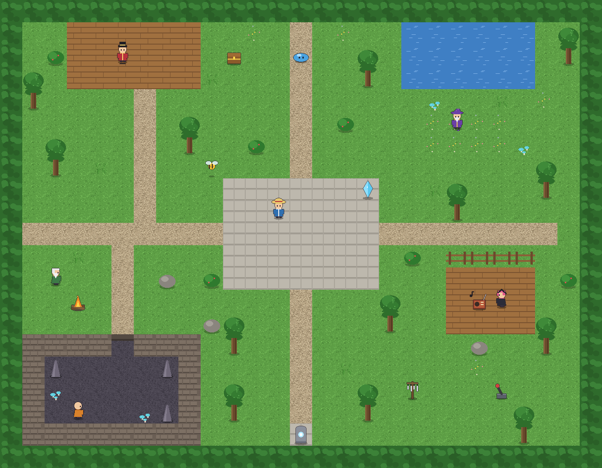

# Sound Garden: the Fugs MultiTrack Audio EX demo

A small playable map for **RPG Maker MZ and MV** where every person and object shows off one part of the plugin pack. Walk around, talk to people, and listen to the mix change.



Everything in it is original and generated from code in [`tools/`](tools): the music (four stems of one song), ambiences, sound effects, tiles and sprites. No RTP assets are used apart from the player character your project already has.

## What each station shows

| Where | Who / what | Feature | Commands it runs |
|-------|------------|---------|------------------|
| On start | (autorun) | Stems in sync, ambience, proximity, aliases | `syncplay-bgm`, `play-bgs1`, `proximity-*`, `effect-bgm5 preset:radio`, `registeralias` |
| Plaza | Guide | Track listing in the console (F8) | `listall` |
| North-west stage | Conductor | Stem mixing: fade parts in and out without restarting them | `fade-bgm1..4` |
| North-east | Wizard | Effect presets faded onto all four stems | `fadeeffect-bgmN preset:cave / underwater / tapeEcho / hauntedHall / giant`, `fadeouteffect` |
| West | Campfire | Proximity volume + stereo pan | `proximity-bgs2 {event:7, pan:true, curve:smooth}` |
| West | Storyteller | Switch-controlled duck while talking | `duckall-bgm 0.25 0.6 0 switch:13` |
| East deck | Radio | A track with its own effect that is only audible nearby | `effect-bgm5 preset:radio / phone / possessedRadio`, `cleareffect-bgm5` |
| East deck | Radio host | Duck everything except one track | `duckall-sidechain bgm5 0.15 1 6` |
| Around the plaza | Bee | Moving source with doppler | `proximity-bgs3 {event:11, doppler:true}` |
| North | Slime | Battle: tracks pause and resume where they left off | default `(pause:battle)` |
| North | Chest | ME fanfare over a ducked band | `duckall-bgm 0.2 0.3 3`, `play-me1` |
| Plaza | Crystal | Save / load restores every track, effect and proximity link | (automatic snapshots) |
| South | Shrine | Pitch bend and heartbeat pump | `pitchbendall-bgm 75 2`, `duckpump 72 0.7 heartbeat bgm`, `stoppump` |
| South-east | Wind chimes | Pan sweep from ear to ear | `pansweep-bgs4 -100 100 6`, `stoppansweep-bgs4` |
| South-east | Storm lever | `switch:N`: rain starts and stops with switch 11 | `play-bgs5 GardenRain 80 3 switch:11` |
| South-west | Cave (walk in) | Region-triggered cave reverb and ambience swap | `fadeeffect-bgmN preset:cave 2`, `play-bgs6 GardenCave` |
| Gravel paths | (walking) | Randomised footsteps from an alias pool | `play-se1 alias:GardenStep` |

Every event carries editor comments explaining what it does, so you can open it in the editor and copy the pattern.

## Install

You need [Node.js](https://nodejs.org) 18 or newer (only for the installer).

1. In RPG Maker MZ or MV, create a **new project** (File > New Project) and close the editor.
2. From this repository's folder, run:

   ```bash
   node demo/install.js "C:/path/to/YourNewProject"
   ```

   Add `--dev` to also enable `FugsAudio8Test` (the `test()` console runner).
3. Open the project again and press **Playtest**.

The installer detects MZ or MV, copies the plugin pack into `js/plugins/` and enables it, copies the demo's audio and images, adds a "Fugs Sound Garden" tileset and a "Sound Garden" map, makes that map the starting point, and names switches 11 to 14. It does not touch your other maps or plugins, and it backs up the files it changes to `fugs-demo-backup/` inside the project. Running it again updates the demo in place.

The editor must be closed while you install, otherwise it will overwrite the changes when it next saves.

## Changing the demo

| File | What it holds |
|------|---------------|
| [`tools/garden.js`](tools/garden.js) | The map layout and every event (one definition for both engines) |
| [`tools/synth.js`](tools/synth.js) | The music and sound effects, written as code |
| [`tools/art.js`](tools/art.js) | Tiles and sprites, drawn as code |
| [`game/`](game) | The generated audio and images (committed, so you don't need to rebuild them) |

After editing `synth.js` or `art.js`, regenerate the files with `node demo/tools/build-assets.js` (needs `ffmpeg` with libvorbis), or without installing anything locally:

```bash
docker build -t fugs-demo demo
docker run --rm -v "$PWD:/repo" fugs-demo
```

`node demo/tools/preview.js` redraws `garden-map.png` from the map definition. The demo's own checks live in `scripts/tests/11-demo-game.test.js` and run as part of `node scripts/verify-all.js`.

## License

GPL-3.0, like the rest of the repository.
