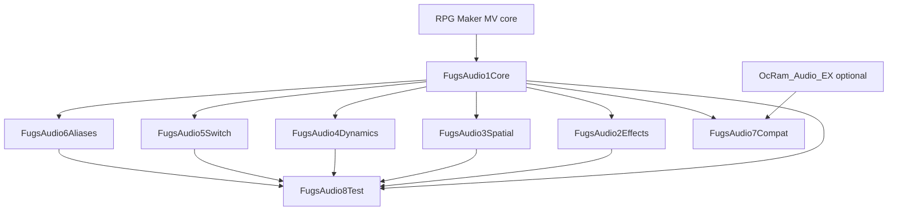

# FugsMultiTrackAudioEX — Multi-Plugin Split Plan

**Status:** **DONE** (Phases 1–6 + B01–B16 + save/load extensions + soft-transition bundle). Remaining: optional in-game `test('play')` on a real MV project.  
**Source:** Core + Docs + Effects + Spatial + Dynamics + Switch + Aliases + Compat + Test  
**Goal:** Split the monolith into readable, independently loadable RPG Maker MV plugins without breaking gameplay, save data, or the existing `FugsAudio` / plugin-command APIs.  
**Last review:** 2026-08-09 — `node scripts/verify-all.js` green (syntax + 50 modular smoke + 11 bundle smoke).

---

## 1. Why Split

The current file is a single IIFE with subsystem objects (`Logger`, `DistanceCurves`, `AudioEffects`, `FadeManager`, `SwitchManager`, `SwitchBuffer`) plus the `FugsMultiTrackAudioEX` hub. That structure is already modular in spirit, but reading and changing it is painful because:

| Problem | Impact |
|---------|--------|
| ~5,260-line test runner bundled in production | ~44% of the file is dev-only |
| ~1,350-line effects + presets block | Hard to navigate around playbook/docs |
| One giant `executeCommand` switch | Every feature fans out from one place |
| Cross-cutting `cleanupTrack` | Touches fades, effects, sidechain, proximity, sweeps |
| Outdated root `README.md` (v1.0) | Real docs live inside `@help` (~1,060 lines) |

Splitting makes each concern readable, lets games load only what they need, and keeps the test suite out of shipped projects.

---

## 2. Current Architecture (As-Is)

### 2.1 Section Map

| Block | Approx. lines | Size |
|-------|---------------|------|
| Plugin metadata + `@help` | 4–1062 | ~1,059 |
| Main IIFE | 1064–13382 | — |
| Params / config | 1065–1072 | ~8 |
| `AUDIO_CONSTANTS` | 1075–1213 | ~139 |
| `Logger` | 1216–1272 | ~57 |
| `DistanceCurves` | 1274–1383 | ~110 |
| `AudioEffects` engine | 1389–2145 | ~757 |
| `AudioEffects.presets` | 2147–2655 | ~509 |
| `AudioEffects` preset API | 2657–2719 | ~63 |
| `FadeManager` | 2721–2861 | ~141 |
| `SwitchManager` | 2863–2956 | ~94 |
| `SwitchBuffer` | 2957–3294 | ~338 |
| Hub: state + init | 3299–3338 | ~40 |
| Pump | 3340–3447 | ~108 |
| SFX aliases | 3449–3715 | ~267 |
| `executeCommand` | 3717–4109 | ~393 |
| Playback (`playAudio`, sync, sidechain setup) | 4111–4765 | ~655 |
| Stop / fade | 4767–5036 | ~270 |
| Ducking / sidechain-duck / pump cmds | 5038–5215 | ~178 |
| Pitch bend / pan sweep | 5217–5352 | ~136 |
| Pause / resume | 5354–5692 | ~339 |
| Effect integration on tracks | 5694–6228 | ~535 |
| Proximity / spatial | 6231–6501 | ~271 |
| Cleanup / buffer release | 6503–6602 | ~100 |
| Save / snapshots | 6604–6792 | ~189 |
| Command parser | 6795–7031 | ~237 |
| Scene transition logic | 7034–7128 | ~95 |
| Utilities (stopAll, crossFade, chain) | 7130–7360 | ~231 |
| Debug / `testCommand` | 7365–7442 | ~78 |
| Public `FugsAudio` script API | 7445–7882 | ~438 |
| Init + globals | 7885–7897 | ~13 |
| Scene hooks + plugin commands | 7899–8089 | ~191 |
| **TestRunner** | **8091–13351** | **~5,261** |
| OcRam compatibility patch | 13353–13381 | ~29 |

### 2.2 Runtime Object Graph

```
window
├── FugsAudio / FugsMultiTrackAudioEX   ← central hub
│   ├── .tracks              Map<"bgm_1", WebAudio buffer>
│   ├── .effectChains
│   ├── .proximityData
│   ├── .sidechainConnections
│   ├── .pumpConfig
│   ├── .pausedTracks / snapshots
│   ├── .sfxAliases
│   ├── .FadeManager
│   ├── .SwitchManager
│   └── .SwitchBuffer
├── AudioEffects
├── FadeManager
├── TestRunner / test()      ← today always loaded with hooks
└── _fugsAudioHooked         ← scene/command hook guard
```

Closure-scoped today (not on `window`): `AUDIO_CONSTANTS`, `Logger`, `DistanceCurves`, plugin params.

### 2.3 Existing Seams (Good News)

Already present and useful as split anchors:

1. Separate `const` subsystem objects with clear headers
2. Hub composition at init (`FadeManager` / `SwitchManager` / `SwitchBuffer` attached)
3. Thin public API wrappers (7445–7882)
4. Idempotent `_fugsAudioHooked` guard
5. Buffer field namespacing (`_fugs*`, `_manualVolume`, `_effect`, etc.)
6. Lazy `WebAudio._context` init in effects

**Missing for multi-plugin safety (Phase 2 addressed):**

- ~~No `registerHandler(action, fn)` command registry~~ → **done**
- ~~No teardown / update callback lists for satellites~~ → **done** (`onTeardown` / `onUpdate` / save / switch hooks)
- ~~No shared `FugsAudio.config` for params across files~~ → **done**
- No `@base` / required-plugin metadata (still optional / docs-only)

---

## 3. Target Architecture (To-Be)

### 3.1 Recommended Plugin Set (numbered root names)

| # | Plugin file | Required? | Build? | Responsibility |
|---|-------------|-----------|--------|----------------|
| 0 | `FugsAudio0Docs.js` | Recommended | **Yes** | Full `@help` playbook for Plugin Manager (no runtime) |
| — | `FugsMultiTrackAudioEX.js` | **Yes** | **Yes** | Core mixer (params + slim help pointer) |
| 1 | `FugsAudio1Core.js` | Planned rename | **Yes** | Same as Core after Phase 6 rename |
| 2 | `FugsAudio2Effects.js` | Optional | Yes | WebAudio effect chains + presets |
| 3 | `FugsAudio3Spatial.js` | Optional | Yes | Proximity / doppler / pan sweep |
| 4 | `FugsAudio4Dynamics.js` | Optional | Yes | Duck / sidechain / pump / pitchbendall |
| 5 | `FugsAudio5Switch.js` | Optional | Yes | SwitchManager + SwitchBuffer |
| 6 | `FugsAudio6Aliases.js` | Optional | Yes | SFX alias pools |
| 7 | `FugsAudio7Compat.js` | Optional | Yes | OcRam `fadeOutBgs` guard |
| 8 | `FugsAudio8Test.js` | Dev-only | **No** | TestRunner + `window.test()` |

**Docs policy:** Giant playbook lives only in `FugsAudio0Docs`. Every other Fugs plugin’s `@help` is a short pointer: *install FugsAudio0Docs to view full docs*. Docs has no runtime cost and **ships in production builds** so authors can read help in Plugin Manager without opening repo files.

### 3.2 Minimal Alternative (3 + Test)

If eight Plugin Manager entries feel heavy:

| Plugin | Contains |
|--------|----------|
| `FugsAudioCore.js` | Same as above |
| `FugsAudioFX.js` | Effects + Spatial |
| `FugsAudioAdvanced.js` | Dynamics + Switch + Aliases |
| `FugsAudioTest.js` | Dev-only |

Start with the 8-plugin plan conceptually; implement extraction in phases. Collapse later if desired.

### 3.3 Load Order (Plugin Manager, top → bottom)

```
[MV stock / other audio plugins e.g. OcRam]
FugsMultiTrackAudioEX      ← Core (required)
FugsAudio0Docs             ← full help (recommended; production OK)
FugsAudio2Effects
FugsAudio3Spatial
FugsAudio4Dynamics
FugsAudio5Switch
FugsAudio6Aliases
FugsAudio7Compat           ← after OcRam, after Core
FugsAudio8Test             ← last, and only in dev projects
```

**Rule:** Core must always be above every runtime Fugs satellite. Docs can sit anywhere after Core (no runtime deps). Compat after OcRam. Test last and never in production.

### 3.4 Dependency Diagram



---

## 4. Extension Contract (Must Build Before Splitting Features)

Without this, satellites will break command routing, cleanup, and scene updates.

### 4.1 Command Registry

Core owns `Game_Interpreter.prototype.pluginCommand` and `executeCommand`.

Satellites register actions:

```javascript
// In Core
FugsAudio.registerHandler("effect", (type, trackId, args, cmd) => { ... });
FugsAudio.registerHandler("duck", handler);
FugsAudio.unregisterHandler("duck"); // optional, for hot reload / tests

// Dispatcher shell
executeCommand(cmd) {
  const handler = this._handlers.get(cmd.action);
  if (!handler) {
    Logger.warn(`Unknown action: ${cmd.action}`);
    return false;
  }
  return handler.call(this, cmd);
}
```

Actions that stay **hard-coded in Core**:

- `play`, `stop`, `fade`, `crossfade`
- `stopall`, `fadeall`, `fadeall-{bgm,bgs,me,se}`
- `syncplay`
- `pause`, `resume`, `pauseall`, `resumeall`
- `chain`, `listall`, `listall-{bgm,bgs,me,se}`
- `saveall`, `loadall`
- `pitch`, `pan` (immediate per-track set)
- Optional: `pitchbendall` / `pitchbendall-*` (bulk pitch fade — currently listed under Dynamics; either is fine if documented)

Actions that **move to satellites** (register on load):

| Plugin | Actions |
|--------|---------|
| Effects | `effect`, `fadeeffect`, `fadeouteffect`, `crossfadeeffect`, `cleareffect` |
| Spatial | `proximity`, `doppler`, `pansweep`, `stoppansweep` |
| Dynamics | `duck`, `duckall`, `duckall-*`, `duckall-sidechain`, `duckpump`, `stoppump`, `sidechain`, `stopsidechain`, `pitchbendall*` |
| Switch | No new actions — owns `switch:` routing (see §6.5). Core must call a Switch hook when `parsed.switchId` is set |
| Aliases | `registeralias`, `unregisteralias`, `listaliases`, plus `alias:` play-path hook |

**Also update Core’s plugin-command re-parse regex** (today incomplete). Current match list:

```text
play|fade|stop|pause|resume|effect|duck|proximity|pitch|crossfade|syncplay|sidechain|doppler|pan
```

Missing from that regex today (and easy to break after split): `duckpump`, `pansweep`, `registeralias`, `fadeeffect`, `cleareffect`, `crossfadeeffect`, etc. Phase 2 should replace this with a registry-driven prefix list (or always re-parse any dashed command Core knows about).

### 4.2 Lifecycle Hooks

```javascript
// Core exposes:
FugsAudio.onTeardown(fn);     // cleanupTrack(key) → call all
FugsAudio.onUpdate(fn);       // Scene_Map.update → proximity/pump/etc.
FugsAudio.onSceneTransition(fn);
FugsAudio.onCaptureState(fn); // save snapshot extras
FugsAudio.onRestoreState(fn); // load extras
```

`cleanupTrack` remains in Core and **must** invoke teardown hooks so Effects/Spatial/Dynamics can disconnect nodes and clear Maps.

### 4.3 Shared Config

Move closure params onto a shared object:

```javascript
window.FugsAudio.config = {
  loggingLevel,
  sceneFadeoutTime,
  defaultDopplerScale,   // Spatial may own/override
  defaultPersistenceMode,
  defaultPauseMode,
};
```

Each plugin may add its own Plugin Manager params; Core keeps the five existing ones unless a param clearly belongs elsewhere (e.g. Default Doppler Scale → Spatial).

### 4.4 Shared Access Rules

| Allowed | Forbidden |
|---------|-----------|
| Read/write `FugsAudio.tracks` | Creating a second track registry |
| Use `FugsAudio.FadeManager` | Patching `Game_Interpreter` again (Core owns it) |
| Register handlers / hooks | Assuming another satellite is loaded |
| Attach `_fugs*` fields on buffers | Replacing Core's scene hooks wholesale |

Satellites **must** guard on load:

```javascript
if (!window.FugsAudio) {
  console.error("[FugsAudio2Effects] FugsAudio1Core / FugsMultiTrackAudioEX must load ABOVE this plugin.");
  return;
}
```

### 4.5 Missing-plugin behavior (policy)

| Situation | Expected behavior |
|-----------|-------------------|
| Satellite loaded, **Core missing** | `console.error` + early return. Optional: stub any public entry points so calls explain the mistake (see `FugsAudio8Test`). |
| Core loaded, **satellite missing** | Game runs. Commands/API for that feature **warn once and no-op** (do not crash). |
| Core loaded, satellite loaded **out of order** (above Core) | Same as Core missing — satellite sees no `FugsAudio` yet. |
| `FugsAudio8Test` missing | Production-fine. `test` is undefined unless Test plugin is on. |
| Test on, Core off | Stub `test()` / `TestRunner.run()` print a clear load-order error (not `ReferenceError`). |
| Feature command with no handler (after Phase 2 registry) | `Logger.warn("Unknown action: …")` — or `"requires FugsAudio2Effects"` if we map action→plugin. |

**Rule of thumb:** missing optional plugins = soft fail + console warning. Missing Core when a satellite is present = hard console error at load.
---

## 5. What Stays in Core Forever

- `tracks` Map and track lifecycle (`playAudio`, `stopAudio`, `cleanupTrack`, `_releaseBuffer`)
- `AudioManager.createBuffer` integration
- `FadeManager`
- Command parser (`parseClassicSyntax`, argument/paren-tag helpers)
- Dispatcher shell + `Game_Interpreter` hook
- Scene hooks (`handleSceneTransition`, persistence/pause policy)
- `DataManager` save/load (`contents.fugsAudio`)
- Public API for play/stop/fade/pause/crossfade/chain/list/save/load
- `Logger` + core constants
- `init()` orchestration
- `_fugsAudioHooked` guard (Core sets it; satellites use registries instead of re-hooking)

---

## 6. Per-Plugin Specs

### 6.1 `FugsAudioCore`

**Params (keep):**

- Debug Logs
- Scene Fadeout Time
- Default Persistence Mode
- Default Pause Mode
- *(Default Doppler Scale moves to Spatial when Spatial is extracted)*

**Exports:**

- `window.FugsAudio`
- `window.FugsMultiTrackAudioEX` (alias, keep for back-compat)
- `window.FadeManager`
- Registry / hook APIs from §4

**Does not include:** effects engine, presets, proximity, duck/pump/sidechain, switch buffer, aliases, tests, OcRam patch.

### 6.2 `FugsAudioEffects`

**Owns:** `AudioEffects` object, preset table, effect-related `AUDIO_CONSTANTS` subset, effect chain Maps (prefer storing chains on `FugsAudio.effectChains` so Core teardown can see them).

**Commands:** effect / fadeeffect / fadeouteffect / crossfadeeffect / cleareffect

**API:** `FugsAudio.setEffect`, `clearEffect`, `fadeEffect`, … — register onto hub at load time (do not leave crashing stubs on Core). If Effects is absent, `setEffect` should warn and return false.

**Play-time coupling:** `playAudio` already accepts `options.effect` / `commandObject.effect`. Core play path must soft-call Effects (`FugsAudio.applyEffectIfPresent?.(…)`) so `play-bgm1 Song effect:cave`-style flows don’t hard-depend on the Effects file being inlined.

**Exports:** `window.AudioEffects`

**Risk:** WebAudio graph order (`_sourceNode → chain → _gainNode`). Teardown hook mandatory.

### 6.3 `FugsAudioSpatial`

**Owns:** `DistanceCurves`, `proximityData`, pan sweep timers

**Param:** Default Doppler Scale

**Commands:** proximity, doppler, pansweep, stoppansweep

**Hooks:** `onUpdate` for `updateProximityVolume`; teardown clears proximity bindings

### 6.4 `FugsAudioDynamics`

**Owns:** duck state, `pumpConfig`, `sidechainConnections`

**Commands:** duck*, duckpump/stoppump, sidechain/stopsidechain, pitchbendall*

**Risk:** `ensurePumpNode` rewires `_gainNode` ↔ panner. Must coordinate with Effects teardown order (document: Effects disconnect first, then Dynamics, or vice versa — pick one and test).

### 6.5 `FugsAudioSwitch`

**Owns:** `SwitchManager`, `SwitchBuffer`

**Behavior:** Queues / restores commands when switches flip; uses Core `executeCommand`

**Hook:** Must init after `$dataSystem` exists (existing retry logic)

**Coupling (stronger than originally implied):** Today the Core plugin-command handler does this inline:

```javascript
if (parsed.switchId) {
  SwitchBuffer.addCommand(parsed.switchId, commandObj);
  if ($gameSwitches && $gameSwitches.value(parsed.switchId)) {
    SwitchBuffer.executeSwitch(parsed.switchId, true);
  }
  return;
}
```

So Switch is not “just another registerHandler.” Core must expose something like:

```javascript
FugsAudio.onSwitchGatedCommand(fn); // (switchId, commandObj) => boolean handled
```

If Switch plugin is absent and a command includes `switch:N`, Core should **warn and either execute immediately or no-op** (pick one; recommend: warn + execute immediately so maps don’t silently break).

Duck restore-on-switch-OFF also lives in this subsystem — keep it with Switch/Dynamics coordination tests.

### 6.6 `FugsAudioAliases`

**Owns:** `sfxAliases`, `aliasLastPlayed`

**Commands:** registeralias, unregisteralias, listaliases

**Hook:** Play-path interceptor for `alias:Name` syntax — today this is **inside** `executeCommand` case `"play"`, not a separate action:

```javascript
if (args[0].toLowerCase().startsWith("alias:")) {
  return this.playAlias(aliasName, type, trackId);
}
```

Core `play` must call `FugsAudio.tryPlayAlias?.(…)` (or similar) so Aliases can stay optional.

### 6.7 `FugsAudioCompat`

**Owns:** OcRam `AudioManager.fadeOutBgs` recursion guard

**Load after OcRam.** Fail soft if OcRam absent.

### 6.8 `FugsAudioTest`

**Owns:** entire TestRunner (~8091–13351 today)

**Exports:** `window.test`, `window.TestRunner`

**Load last.** Skip entirely in production projects.

---

## 7. Phased Execution Plan

### Phase 0 — Prep (no behavior change)

1. Freeze public API surface (document current `FugsAudio.*` methods).
2. Add this plan to repo (`docs/MULTI_PLUGIN_SPLIT_PLAN.md`) — **done**.
3. Optionally update root README to point at this plan + note v2.2.
4. Establish a smoke checklist (see §9).

### Phase 1 — Extract TestRunner (highest value / lowest risk) ✅ DONE

1. Cut TestRunner into `FugsAudio8Test.js` at repo root.
2. Guard: require `window.FugsAudio`; soft-warn if `DistanceCurves` missing.
3. Monolith exports `window.DistanceCurves` + `FugsAudio.Logger` for the test plugin.
4. OcRam patch remains in the monolith.
5. Enable in Plugin Manager **below** `FugsMultiTrackAudioEX.js` (dev projects only).

**Exit criteria:** Monolith ~8.1k lines (tests removed); `test()` available when `FugsAudio8Test` is enabled.

### Phase 2 — Core extension contract ✅ DONE

1. Refactor `executeCommand` to a handler Map + Core defaults (`registerHandler` / `unregisterHandler` / `hasHandler`).
2. Add `onTeardown` / `onUpdate` / `onSceneTransition` / `onCaptureState` / `onRestoreState` / `onSwitchGatedCommand`.
3. Move config onto `FugsAudio.config` (dual-read params: `FugsAudio1Core` then `FugsMultiTrackAudioEX`).
4. Registry-driven plugin-command quote re-parse (`isKnownPluginCommand`).
5. Soft play-path hooks: `tryPlayAlias`, `applyEffectIfPresent`.
6. Plugin-command path now forwards `loop` (and `effect` if present).
7. Keep everything still in one file — registry used internally first.

**Exit criteria:** Same behavior, registry-based dispatch, no new plugin files yet (Test already extracted). **Met 2026-08-07.**

### Phase 3 — Extract Effects ✅ DONE

1. Move `AudioEffects` + presets + effect track methods into `FugsAudio2Effects.js`.
2. Register effect commands via `registerHandler` (overwrites Core soft stubs).
3. Register `onTeardown` to disconnect chains.
4. Keep `window.AudioEffects` export from the Effects plugin.
5. Core keeps soft stubs + `applyEffectIfPresent` so Core-only play/fade/stop still works.

**Exit criteria:** Effect presets/commands work only when Effects plugin is loaded; Core-only project can still play/fade/stop. **Met 2026-08-07.**

### Phase 4 — Extract Spatial + Dynamics ✅ DONE

1. Spatial plugin (`FugsAudio3Spatial.js`): `DistanceCurves`, proximity, doppler, pan sweep + public API.
2. Dynamics plugin (`FugsAudio4Dynamics.js`): duck*, pump, sidechain, pitchbendall* + public API.
3. Teardown order documented in both `@help` blocks: **Effects → Spatial → Dynamics** (registration order = `onTeardown` order).
4. Core keeps soft stubs (methods + `registerHandler` soft actions) + maps (`proximityData`, `panSweeps`, `sidechainConnections`, `pumpConfig`).
5. `Scene_Map.update` calls `runUpdateHooks()` only (satellites own proximity/pump ticks).

**Exit criteria:** Feature flags via Plugin Manager; Core alone still ships a usable mixer. **Met 2026-08-07.**

### Phase 5 — Extract Switch + Aliases + Compat ✅ DONE

1. `FugsAudio5Switch.js` — SwitchManager + SwitchBuffer + `onSwitchGatedCommand` + `SwitchManager.init()`.
2. `FugsAudio6Aliases.js` — register/unregister/list/play alias + handlers; overwrites `tryPlayAlias`.
3. `FugsAudio7Compat.js` — OcRam `fadeOutBgs` recursion guard (idle if OcRam absent; idempotent patch flag).
4. Core soft stubs for alias methods/commands; Core alone executes `switch:N` immediately with warn.
5. Dynamics: SwitchBuffer resolved at call time (`getSwitchBuffer`) so Switch can load **after** Dynamics.

**Exit criteria:** Full parity with current monolith when all plugins enabled in correct order. **Met 2026-08-07.**

### Phase 6 — Docs & DX ✅ DONE (rename/bundle optional)

1. ~~Full playbook → `FugsAudio0Docs.js`; slim `@help` on Core + satellites~~ **done**
2. ~~Rewrite root README for v2.2 multi-plugin layout~~ **done**
3. ~~Load-order snippet in README + Docs `@help`~~ **done** (screenshot optional)
4. Soft-transition: keep `FugsMultiTrackAudioEX.js` as modular Core + dual-read params; concatenated bundle via `node scripts/build-bundle.js` → `dist/FugsMultiTrackAudioEX.bundle.js` **done**
5. ~~Trim outdated “DEV/sources/…” paths inside Docs playbook~~ **done**

---

## 8. Risks and Mitigations

| Risk | Mitigation |
|------|------------|
| Broken commands after split | Handler registry + Phase 2 before feature extraction |
| Leaked WebAudio nodes | Mandatory `onTeardown` per satellite; add Test cases for cleanup |
| Pump vs effect graph conflict | Document insertion order; add integration tests |
| Double scene hooks | Only Core sets `_fugsAudioHooked`; satellites use `onUpdate` |
| Save incompatibility | Keep `contents.fugsAudio` schema stable; optional extras via `onCaptureState` |
| Param fragmentation | Prefer Core params initially; move only Doppler to Spatial |
| Wrong Plugin Manager order | Hard `console.error` + early return if Core missing |
| OcRam patch order | Compat plugin docs: place after OcRam |
| Hot reload / `_fugsAudioHooked` | Document: refresh after plugin changes |
| Chromium 65 / NW.js node budget | Don't increase node count; splitting files ≠ more nodes |
| Duck-during-fade footgun | Preserve existing documented limitation; don't "fix" mid-split |

---

## 9. Smoke / Acceptance Checklist

Offline gate: `node scripts/verify-all.js` (syntax + modular smoke + bundle).  
In-game items still need a real MV project (ear-check / scene transitions).

### Core-only

- [x] `play` / `fade` / `stop` dispatch — Node smoke (`accept play/fade/stop`)
- [ ] `crossfade-bgm1 Battle 3` — in-game
- [ ] `syncplay-bgm A B C` (if stems available) — in-game
- [x] Pause / resume path — Node smoke (+ B01/B03/B04/B16 unit coverage earlier)
- [x] Save / load restores tracks + spatial/dynamics meta — Node smoke (B06/B12)
- [x] `FugsAudio` hub / `executeCommand` — Node smoke
- [x] Effect / proximity / duck soft-stubs when satellites absent — verified at split; modular smoke loads full pack

### With Effects

- [x] Effect handler registered when Effects loaded — Node smoke
- [ ] `effect-bgm1 preset:cave` audible path — in-game
- [ ] `fadeouteffect` / `cleareffect` — in-game
- [x] Stop/teardown cleans effect chains via hooks — wired; covered by teardown hook count smoke

### With Spatial

- [x] Proximity setup + every-frame update (B05/B14) — code + smoke restore
- [x] Pan sweep start/stop + save/restore — Node smoke
- [ ] Doppler audible path — in-game

### With Dynamics

- [x] Duck / sidechain / pitchbend handlers — Node smoke
- [x] Sidechain replace + envelope timing (B07/B11) — code + smoke
- [x] Pump save/restore via `__fugsMeta` — Node smoke
- [ ] `duckpump` audible path — in-game

### With Switch / Aliases / Compat / Test

- [x] SwitchBuffer attached when Switch loaded — Node smoke
- [x] Alias register + play — Node smoke
- [x] Compat loads idle without OcRam — Node smoke (full pack load)
- [x] `FugsAudio8Test` loads (`test` global) — Node smoke
- [ ] `await test('play')` in a real MV project — in-game

---

## 10. Transition Strategy for Existing Users

**Critical MV constraint — plugin filename = param key**

Today:

```javascript
PluginManager.parameters("FugsMultiTrackAudioEX");
```

If Core is renamed to `FugsAudioCore.js`, existing projects lose all Plugin Manager param values unless we:

1. Keep shipping a file named `FugsMultiTrackAudioEX.js` as the Core (or as a thin redirect/bundle), **or**
2. Document a one-time re-entry of params under the new name, **or**
3. Read both keys: `PluginManager.parameters("FugsAudioCore")` with fallback to `"FugsMultiTrackAudioEX"`.

**Prefer (3) + keep `FugsMultiTrackAudioEX.js` as Option A bundle during transition.**

**Option A — Soft transition (recommended)**

1. Keep `FugsMultiTrackAudioEX.js` as a temporary **concatenated bundle** (same behavior as today). MV has no clean multi-file loader; do **not** rely on dynamic `<script>` injection.
2. Ship split plugins alongside for people who want modular installs.
3. Document migration: replace one plugin with the ordered list; re-check Plugin Manager params.
4. After N releases, deprecate the bundle.

**Option B — Hard cut**

1. Replace monolith with Core + satellites in one release.
2. Provide a migration note in README and `@help` (filename + param remapping).

**Recommendation:** Option A (true concatenate bundle) once Phase 3+ is stable; while iterating in this repo, hard-cut locally is fine.

Back-compat aliases to preserve:

- `window.FugsAudio`
- `window.FugsMultiTrackAudioEX`
- `window.AudioEffects` (when Effects loaded)
- Existing plugin command grammar (no renames)
- `contents.fugsAudio` save key
- Param read fallback for old plugin name (see above)

---

## 11. Suggested Repo Layout After Split

**Decision:** all plugins live at **repo root** (next to each other in file explorer).  
**Naming:** numbered prefixes so Explorer sorts them in load order:

```
FugsMultiTrackAudioEX/
├── README.md
├── LICENSE
├── docs/
│   └── MULTI_PLUGIN_SPLIT_PLAN.md
├── FugsMultiTrackAudioEX.js   ← temporary monolith/bundle during transition
├── FugsAudio1Core.js          ← Phase 2+
├── FugsAudio2Effects.js
├── FugsAudio3Spatial.js
├── FugsAudio4Dynamics.js
├── FugsAudio5Switch.js
├── FugsAudio6Aliases.js
├── FugsAudio7Compat.js
└── FugsAudio8Test.js          ← Phase 1 DONE (dev only)
```

MV projects copy these into `js/plugins/`. Keep the numbers so Plugin Manager file lists and disk folders stay aligned.

| # | File | Status |
|---|------|--------|
| 0 | `FugsAudio0Docs.js` | **Done** (playbook; production build OK) |
| — | `FugsMultiTrackAudioEX.js` | Core (slim help + params) |
| 1 | `FugsAudio1Core.js` | Planned rename |
| 2 | `FugsAudio2Effects.js` | **Done (Phase 3)** |
| 3 | `FugsAudio3Spatial.js` | **Done (Phase 4)** |
| 4 | `FugsAudio4Dynamics.js` | **Done (Phase 4)** |
| 5 | `FugsAudio5Switch.js` | **Done (Phase 5)** |
| 6 | `FugsAudio6Aliases.js` | **Done (Phase 5)** |
| 7 | `FugsAudio7Compat.js` | **Done (Phase 5)** |
| 8 | `FugsAudio8Test.js` | **Done (Phase 1)** — **dev only, not production** |
---

## 12. Decision Log

| Decision | Choice | Notes |
|----------|--------|-------|
| Target shape | 8 numbered root plugins | `FugsAudio1Core` … `FugsAudio8Test` |
| First extraction | TestRunner → `FugsAudio8Test.js` | **Phase 1 done** |
| Extension contract | Handler Map + lifecycle hooks in monolith | **Phase 2 done** |
| Effects extract | `FugsAudio2Effects.js` + Core soft stubs | **Phase 3 done** |
| Spatial + Dynamics extract | `FugsAudio3Spatial.js` + `FugsAudio4Dynamics.js` | **Phase 4 done** |
| Switch + Aliases + Compat | `FugsAudio5Switch` / `6Aliases` / `7Compat` | **Phase 5 done** |
| Dynamics ↔ Switch | Soft `getSwitchBuffer()` at duck time | Switch may load after Dynamics |
| Teardown order | Effects → Spatial → Dynamics (load order) | Documented in satellite `@help` |
| Soft-missing warnings | `console.warn` (not `Logger.warn`) | Visible at default loggingLevel 2 |
| Repo layout | Repo root (not `plugins/`) | Sortable numbered filenames |
| Prerequisite for feature split | Handler + lifecycle registry | Phase 2 |
| Public API | Keep `FugsAudio.*` names | No breaking renames |
| Bundle strategy | Soft transition (Option A) preferred | Finalize at Phase 6 |
| README | v2.2 multi-plugin | **Phase 6 done** |
| Switch absent + `switch:N` | warn + execute immediately | Implemented in Phase 2 plugin-command path |
| Core filename | Keep `FugsMultiTrackAudioEX.js` | Dual-read already supports future `FugsAudio1Core` |

---

## 13. Immediate Next Actions

1. ~~Phases 1–6~~ **done**
2. ~~B01–B16~~ **done**
3. ~~Proximity / panSweep / sidechain / pump save-restore~~ **done** (`ext.*` + `__fugsMeta`)
4. ~~Soft-transition bundle~~ **done** — `node scripts/build-bundle.js` → `dist/FugsMultiTrackAudioEX.bundle.js`
5. ~~Offline verify gate~~ **done** — `node scripts/verify-all.js`
6. **Only remaining (needs your MV project):** enable pack + `FugsAudio8Test` → `await test('play')` and listen through menu/battle/save.

Plugin Manager (production):

```
[OcRam_Audio_EX if used]
FugsMultiTrackAudioEX
FugsAudio0Docs            ← full help (recommended)
FugsAudio2Effects         ← as needed
FugsAudio3Spatial
FugsAudio4Dynamics
FugsAudio5Switch
FugsAudio6Aliases
FugsAudio7Compat
```

Plugin Manager (dev): same as production + `FugsAudio8Test` last.

---

## 14. Plan Review Notes (2026-07-16)

Cross-check against `FugsMultiTrackAudioEX.js`. Verdict: **direction is solid; several couplings were understated.** Fixes above are incorporated; summary:

### Still good

| Item | Verdict |
|------|---------|
| Phase order (Test → registry → Effects → rest) | Correct; lowest risk first |
| Core owns tracks / FadeManager / scene hooks / save | Correct |
| Effects as first production extract | Correct; most self-contained object |
| 8-plugin vs 3-plugin fork | Fine; don’t bikeshed before Phase 1 |
| Soft transition via real concatenate bundle | Correct for MV (no multi-file loader) |

### Gaps found and patched into this doc

| Gap | Why it matters |
|-----|----------------|
| **Plugin filename = `PluginManager.parameters` key** | Renaming Core breaks existing project params unless fallback/bundle |
| **Switch is inline in the plugin-command hook** | Not optional without an `onSwitchGatedCommand` (or equivalent) hook |
| **`alias:` handled inside `play`** | Needs play-path hook, not only new actions |
| **`play` can carry `effect`** | Core must soft-call Effects |
| **Re-parse regex is incomplete today** | Split will make missing prefixes more painful; fix in Phase 2 |
| **TestRunner sits inside `_fugsAudioHooked` else-block** | Extract must not reuse that guard |
| **OcRam patch is after TestRunner** | Don’t accidentally delete it when cutting tests |
| **Core action list was incomplete** | Missing `pauseall`/`resumeall`/`saveall`/`loadall`/`pitch`/`pan`/`fadeall-*`/`listall-*` |
| **“Bundle loads other plugins”** | Clarified: concatenate, don’t dynamically load |
| **Core line estimate** | Clarified as range; `@help` size dominates |

### Open decisions (still needed)

1. **8 plugins vs 3+Test** end state (default remains 8 numbered root files).
2. ~~**Repo layout:** root vs `plugins/`~~ → **root + numbered names** (decided).
3. ~~**When Switch absent + `switch:N` present:**~~ → **warn + execute immediately** (decided + implemented Phase 2).
4. **`pitchbendall` ownership:** Core vs Dynamics.
5. **Keep filename `FugsMultiTrackAudioEX.js` as Core/bundle** for param compatibility, or rename to `FugsAudio1Core` + dual-read params (dual-read already in place).

### Recommended start

**Phases 1–5 complete.** Next: Phase 6 docs/DX (and optional Core rename).

### Verification notes (2026-08-07)

| Check | Result |
|-------|--------|
| Core alone: play/stop/fade dispatch | Works via remaining `executeCommand` switch |
| Core alone: effect / proximity / duck / registeralias | Soft-fail `console.warn` + return `false` |
| Core alone: `switch:N` with no Switch plugin | Warn + execute immediately |
| + Effects / Spatial / Dynamics | Handlers + methods overwrite soft stubs |
| Dynamics before Switch | Loads; switch-controlled duck warns until Switch present |
| + Switch | `SwitchBuffer` on hub; `onSwitchGatedCommand` registered |
| + Aliases | `registeralias` / `listaliases` / `playAlias` work |
| + Compat without OcRam | Idle success log, no crash |
| Teardown / update hooks (FX+Spatial+Dyn) | 3 teardown, 2 update |
| Soft-missing messages | **`console.warn`** (visible at default loggingLevel 2) |

**Still in Core (Phase 6 / polish):** optional rename to `FugsAudio1Core.js`, dead `switch` cases for satellite actions (overridden by registry), root README rewrite.
